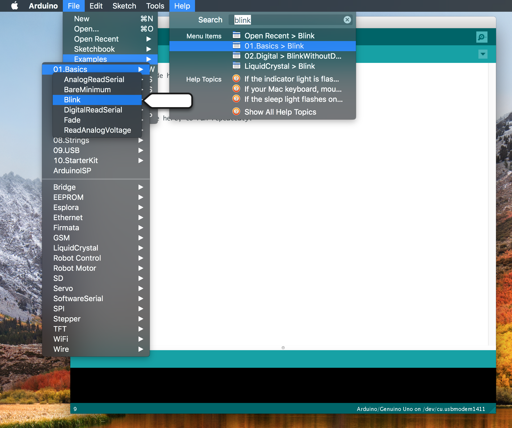
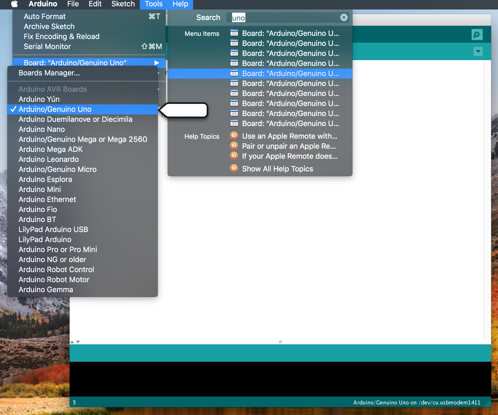
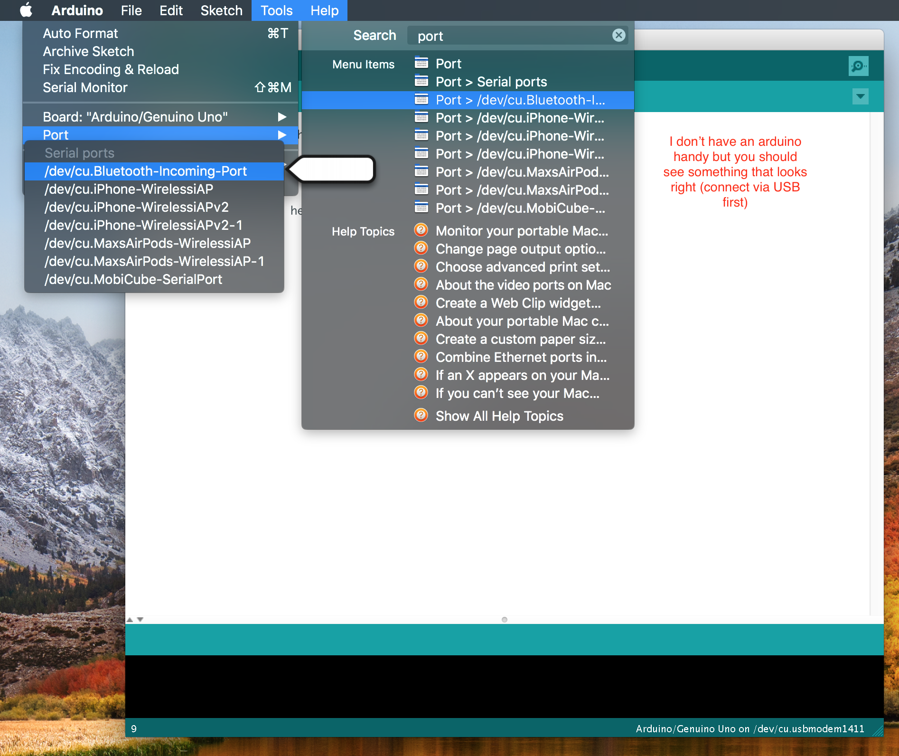
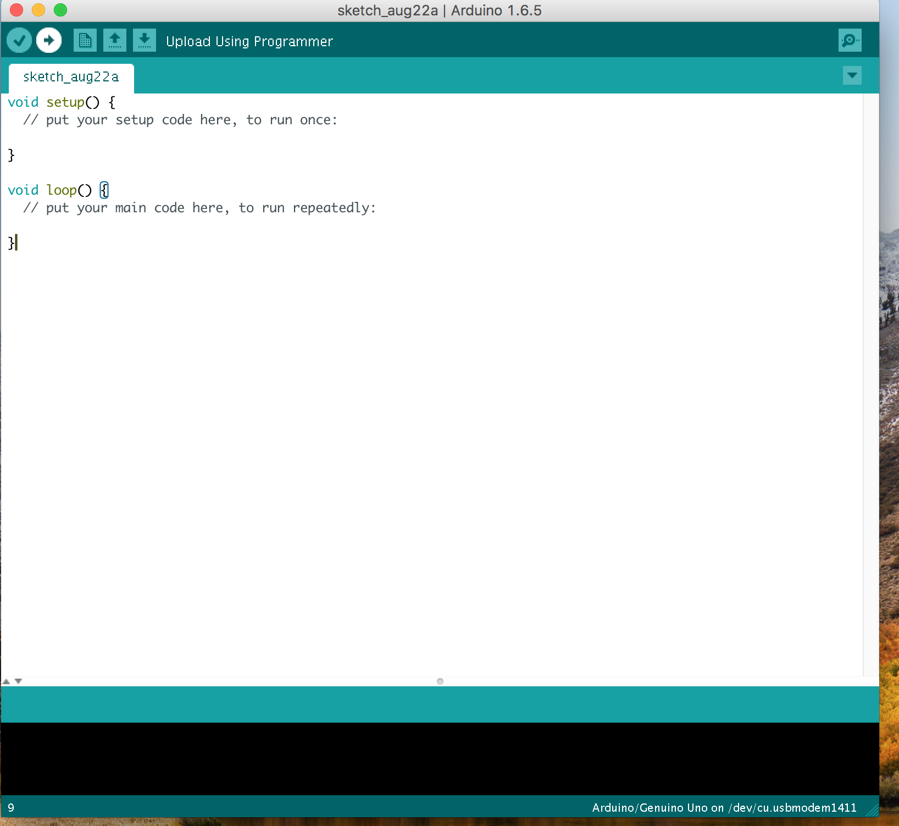

# arduino-lasers

1. Install the [Arduino IDE](https://www.arduino.cc/en/Main/Software)
2. Run IDE and open the blink example sketch

3. Select Arduino Uno (or whatever board you have) from board menu

4. Connect board via USB and select serial/com port

5. Press upload

